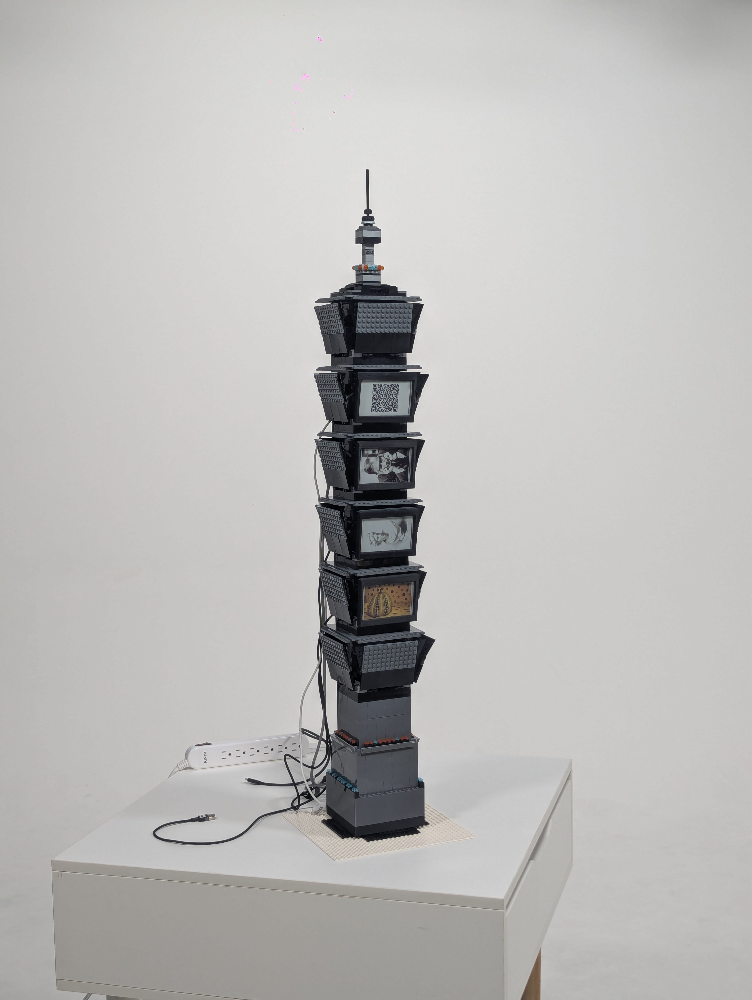
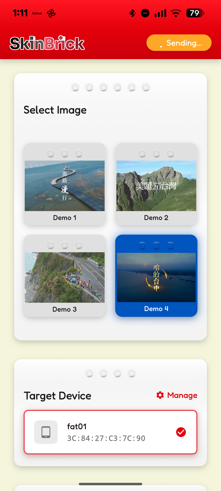
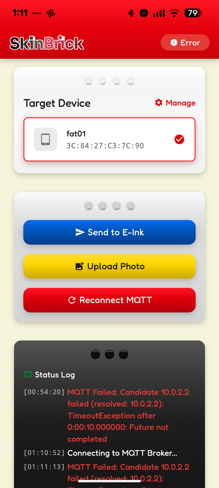

# InkSync

分散式多裝置 E-Paper 控制系統

## 畫面與裝置展示

| PXL（電子紙圖檔） | Screenshot（首頁圖檔） | Target Device（裝置與操作選單圖檔） |
| --- | --- | --- |
|  |  |  |

目前主線版本已全面採用 MQTT 架構：
- Arduino 是 MQTT Client，接收裝置專屬 Topic 指令。
- Flutter App 是 MQTT Client，負責發送指令與監聽狀態。
- Desktop 上的 Mosquitto 擔任 MQTT Broker。

## 專案組成

### 1. [Arduino](./Arduino)
- 負責連線 Wi-Fi、訂閱 MQTT 指令、下載圖片並刷新電子紙。
- 會將裝置 MAC 轉成專屬 Topic：`devices/{MAC}/cmd`、`devices/{MAC}/state`。
- 支援 JPEG/PNG 解碼與 dithering，輸出到 4.0 吋 7 色電子紙。

### 2. [Flutter](./Flutter)
- 提供手機控制介面與裝置綁定流程（手動輸入或掃描 MAC）。
- 圖片先經裁切處理並上傳 Cloudflare R2，再透過 MQTT 發送 URL 指令。
- 可訂閱裝置狀態 Topic，即時顯示 `queued/downloading/success/error` 等狀態。

### 3. [broker_setup](./broker_setup)
- 提供 Mosquitto 安裝、設定與測試步驟。
- 工作坊第一階段建議在本地桌機部署 Broker（Port 1883）。

## 系統流程

1. 啟動 Mosquitto Broker（建議主機名 `epaper-broker.local`）。
2. ESP32 開機連網，訂閱 `devices/{自身MAC}/cmd`。
3. Flutter 選擇目標裝置後，將照片上傳到 R2，取得公開 URL。
4. Flutter 發送 MQTT 指令，例如：
	- `{"action":"update","url":"https://...","slot":1}`
	- `{"action":"show","slot":1}`
	- `{"action":"clear"}`
5. ESP32 執行顯示流程，並回報到 `devices/{MAC}/state`。

## 快速開始

1. 先完成 Broker 部署：[broker_setup/README.md](./broker_setup/README.md)
2. 燒錄韌體：[Arduino/README.md](./Arduino/README.md)
3. 啟動 App：[Flutter/README.md](./Flutter/README.md)
4. iOS 打包請看：[docs/ios_build_guide.md](./docs/ios_build_guide.md)

## 舊版分支（REST 時期保留）

- 已保留舊版歷史分支：`legacy-cfb2c96`
- 對應 commit：`cfb2c96`

## 技術棧

- Hardware: ESP32-S3, Waveshare 4.03" 7-Color E-Paper, NeoPixel
- Firmware: PlatformIO, PubSubClient, ArduinoJson, LittleFS
- App: Flutter, Riverpod, mqtt_client, multicast_dns, mobile_scanner
- Infra: Mosquitto MQTT Broker, Cloudflare R2

## License

MIT
